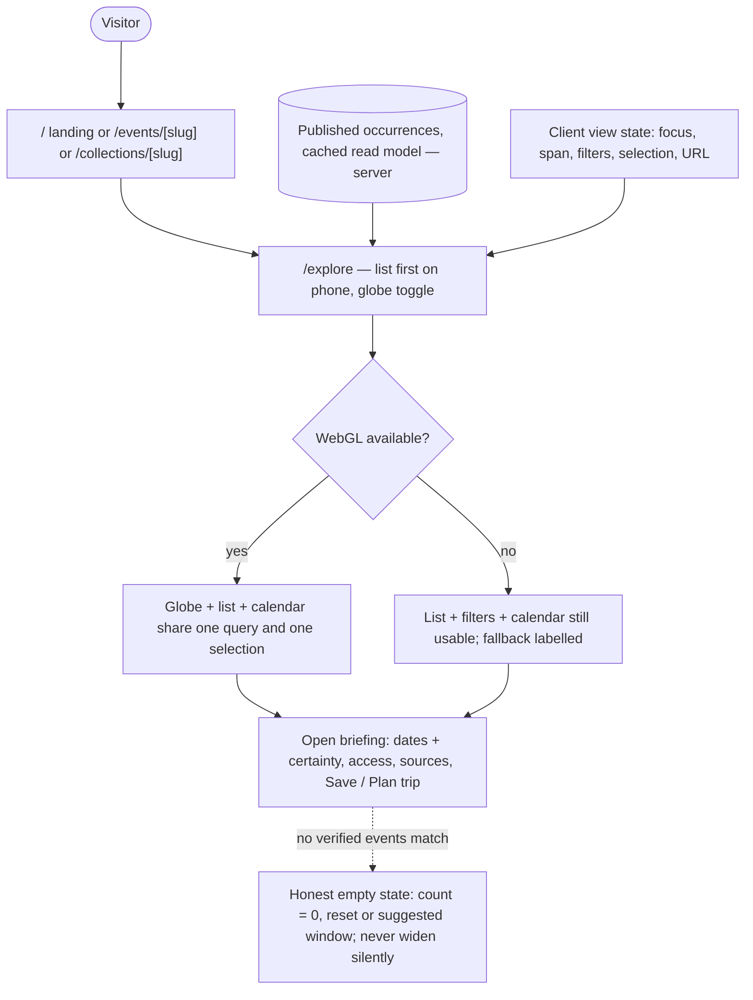
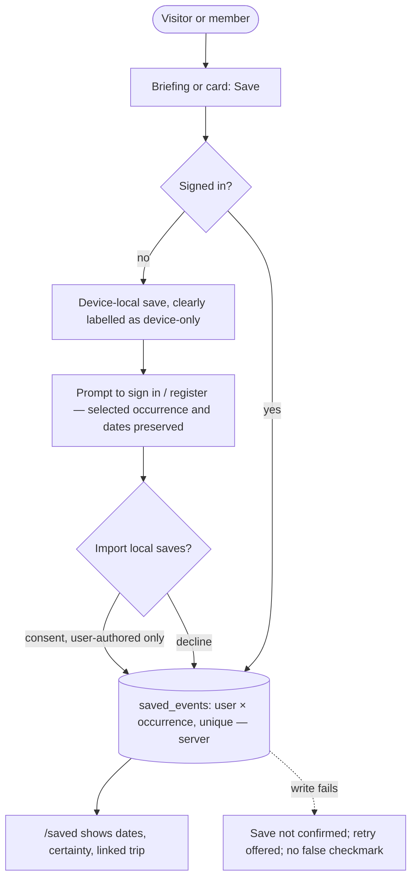
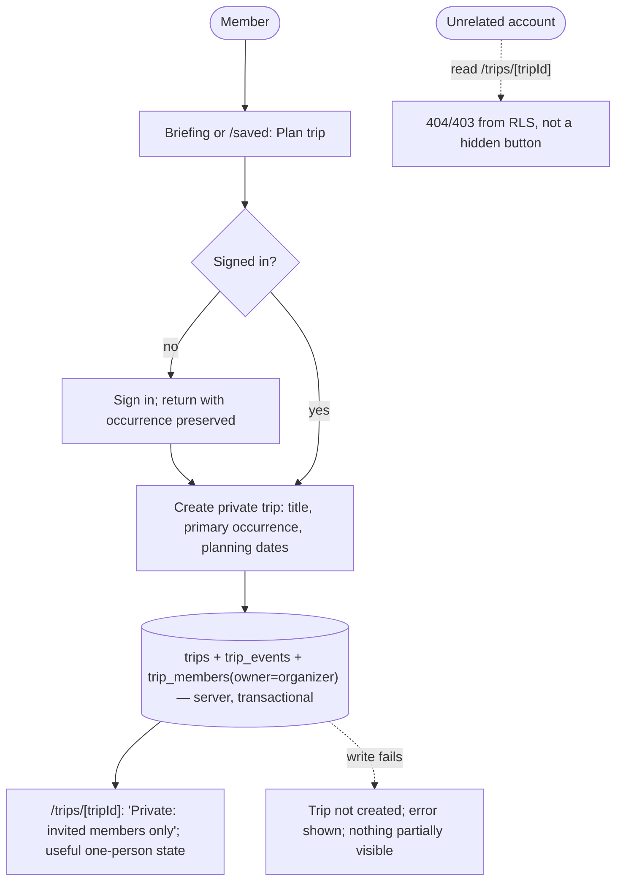
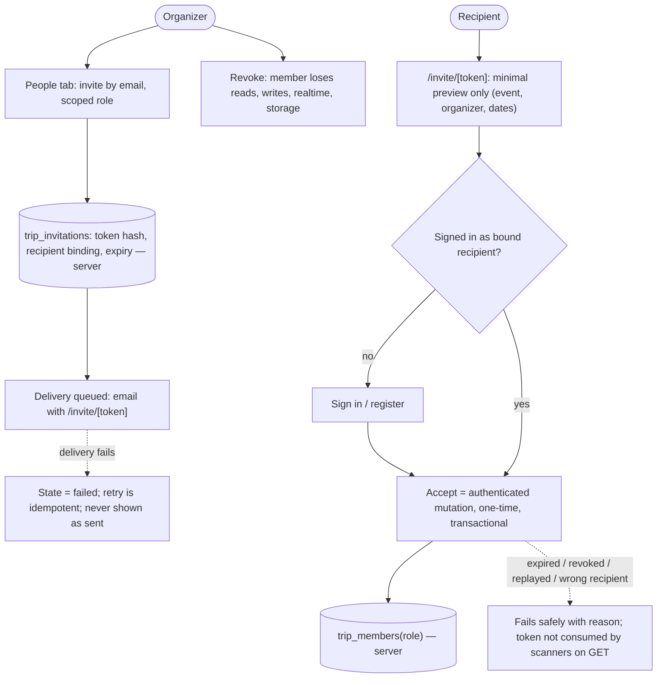
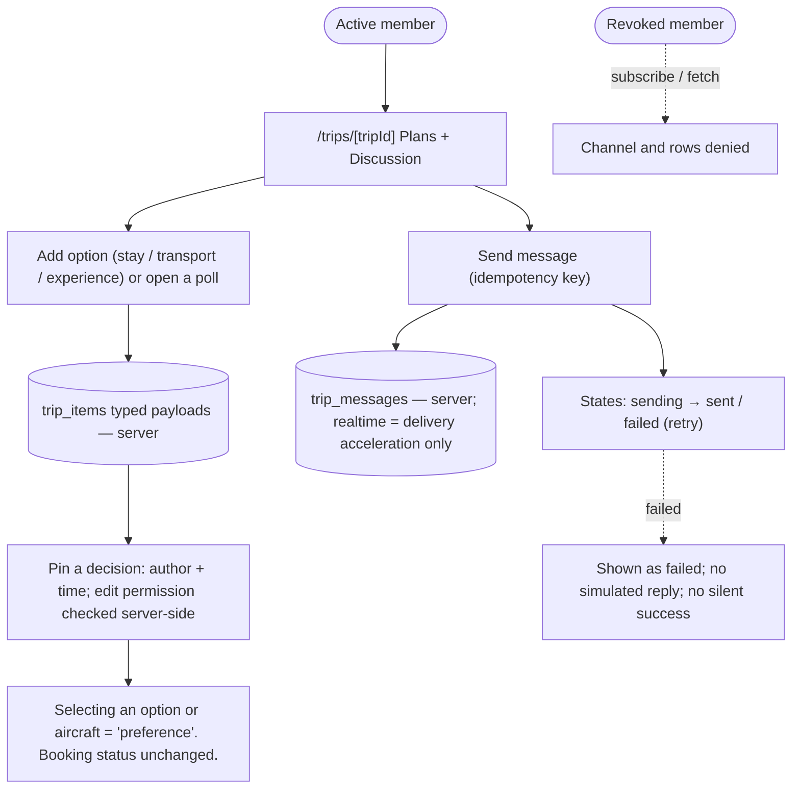
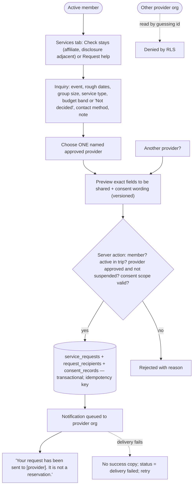
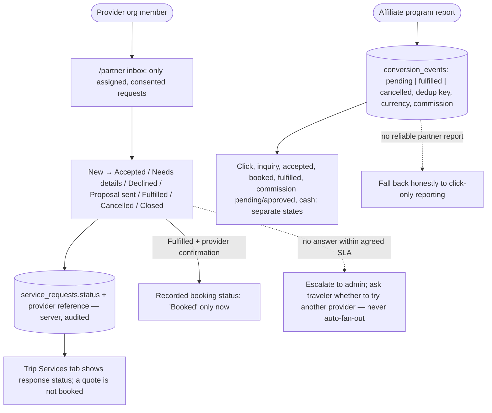

# Phase 0 — M-006 Flow, route and contract map

**Status:** proposed for approval (M-006, owner UX). **Source read at:** branch
`claude/world-events-travel-globe-ykgfs7`, commit `17663a4` (two commits past
the audited `6cab1fd7b2346ed23fa4427423c93e1b927ec064`). The M-002 commit
`aa72ed0` landed while this was being written; it changed tooling,
`src/components/ui/ScrollArea.tsx`, `src/components/ui/tokens.ts`,
`src/lib/data/events/golf.ts` and `src/lib/geo/geojson.ts` only — none of the
files quoted below. **Companion:** `BASELINE.md` (M-001),
`LINT-BASELINE.md` (M-002), `backlog.json`, `agents/*.md`.

Every signature below is quoted from the file named next to it. Where the plan
and the code disagree, the code is documented here and the disagreement is
listed in §6.

---

## 1. Preserve list — contracts a refactor must keep

### 1.1 Domain contract — `src/lib/types.ts`

The file's own header calls it "the single source of truth shared by every
subsystem … Treat it as frozen. If a subsystem needs a new field, it belongs
here first." It is integrator-owned (see §4).

**`Beacon`** — "The globe renderer's only input. Produced by selectors, never by
the renderer itself — the renderer must stay a pure function of this array."

```ts
export interface Beacon {
  eventId: string;
  coords: GeoPoint;
  /** 0 .. 100 */
  score: number;
  heat: HeatLevel;
  category: EventCategory;
  label: string;
  /** City, used for the de-cluttered label at low zoom */
  city: string;
  /** 0 .. 1 — how "live" this beacon is at the current timeline position. */
  relevance: number;
  /** Negative if the event has already started */
  daysUntil: number;
  /** True when this is the user's focused/selected event */
  focused: boolean;
  /** Number of peers signalling interest — drives the ring count */
  peerCount: number;
}
```

Supporting types the beacon depends on: `GeoPoint { lat: number; lon: number }`,
`HeatLevel = 'smoldering' | 'warm' | 'hot' | 'blazing' | 'supernova'`
(ordered in `HEAT_LEVELS`), and `EventCategory` = one of the 17 literals in
`EVENT_CATEGORIES` (`art, music, motorsport, sailing, ski, culinary, fashion,
wellness, safari, equestrian, film, design, golf, tennis, nature, cultural,
gala`).

**`WorldEvent`** — the curated record. Field list, verbatim:

```ts
export interface WorldEvent {
  id: string;                      // Stable slug, e.g. "monaco-grand-prix"
  name: string;
  tagline: string;                 // One line, ≤ 90 chars, no trailing period
  category: EventCategory;
  secondaryCategories?: EventCategory[];
  city: string;
  country: string;
  countryCode: string;             // ISO 3166-1 alpha-2, uppercase
  coords: GeoPoint;
  timezone: string;                // IANA zone
  start: string;                   // Inclusive ISO date, YYYY-MM-DD
  end: string;                     // Inclusive ISO date; equal to start for single-day
  recurrence: Recurrence;          // 'annual' | 'seasonal' | 'biennial' | 'one-off'
  tier: EventTier;                 // 'legendary' | 'marquee' | 'insider'
  priceIndex: 1 | 2 | 3 | 4 | 5;
  estimatedSpend: SpendEstimate;   // { min: number; max: number; currency: 'USD' }
  accessNote: string;
  venues: string[];
  nearestJetPort: Airport;         // { code; name; coords; fboQuality: 'exceptional'|'excellent'|'adequate' }
  bookingLeadDays?: number;        // optional; per-category default in src/lib/alerts/leadTimes.ts
  description: string;             // 2–4 sentences
  whyGo: string[];                 // 3–5 short reasons
  tags: string[];
  signals: BuzzSignals;
}
```

`BuzzSignals` = `{ socialMentions; socialVelocity; searchInterest;
mediaMentions; bookingPressure; exclusivity }` (all `number`). Note for M-007:
there is **no** date-certainty, evidence URL, checked-at, reviewer, lifecycle or
observation-provenance field anywhere in this contract (audit A05 holds).
`fboQuality` and `bookingPressure` are curated judgments presented as data.

Other exports in the file that downstream code imports and must keep their
names: `EVENT_CATEGORIES`, `HEAT_LEVELS`, `DEFAULT_FILTERS`, and the types
`BuzzScore`, `EventFilters`, `TimelineWindow`, `SourceHealth`, `EventSource`,
`Member`, `InterestSignal`, `InterestLevel`, `GroupStatus`, `TravelGroup`,
`JetOption`, `CharterQuote`, `MemberTier`, `GroupMembership`.

### 1.2 The three view-state stores (Zustand; view state only)

**`src/lib/stores/useTimelineStore.ts`**

| Export | Semantics |
|---|---|
| `DEFAULT_SPAN_DAYS = 10` | Days either side of the scrubber that count as "in view". |
| `toISODate(d: Date): string` | `YYYY-MM-DD` in UTC. |
| `addDays(iso: string, days: number): string` | UTC day arithmetic on ISO dates. |
| `daysBetween(a: string, b: string): number` | Whole days from `a` to `b`. |
| `useTimelineStore` | The store. State: `focus: string` (scrubber position, ISO), `spanDays: number`, `rangeStart: string` (= `today`), `rangeEnd: string` (= `addDays(today, 425)`), `playing: boolean`, `playSpeed: number` (days/second, default 6), `scrubbing: boolean` ("True while the user is actively dragging — suppresses camera flights"). Actions: `setFocus(iso)` (clamped to range), `nudge(days)`, `setSpan(days)` (clamped 1..90), `setScrubbing(v)`, `togglePlay()`, `setPlaySpeed(v)`, `reset()` (focus→today, span→default, playing→false). |

`today`, `rangeStart` and `rangeEnd` are computed **once at module
evaluation** (A11). Playback is not in the store: `src/components/timeline/Transport.tsx`
drives `setFocus` from `requestAnimationFrame` (`carry += dt * playSpeed`) and
stops at `rangeEnd` rather than looping.

**`src/lib/stores/useGlobeStore.ts`**

| Export | Semantics |
|---|---|
| `type GlobeQuality = 'high' \| 'balanced' \| 'economy'` | Renderer quality tier. |
| `useGlobeStore` | State: `selectedEventId: string \| null` ("Event the user has committed attention to — opens the dossier"), `hoveredEventId: string \| null` ("drives the hover readout, never the dossier"), `flight: { target: GeoPoint; distance: number; nonce: number } \| null` (pending camera move), `autoRotate: boolean`, `ready: boolean` ("True once the globe has finished its opening move and geometry is up"), `quality`, `showLandmass`, `showGraticule`. Actions: `select(id)` (also sets `autoRotate:false` when `id` is non-null), `hover(id)`, `flyTo(target, distance = 3.5)` (bumps `nonce`, sets `autoRotate:false`), `consumeFlight()`, `setAutoRotate(v)`, `setReady(v)`, `setQuality(q)`, `toggleLandmass()`, `toggleGraticule()`. |

**`src/lib/stores/useChromeStore.ts`** (persisted to `localStorage` under
`meridian.chrome.v1`)

| Export | Semantics |
|---|---|
| `useChromeStore` | State: `timelineCollapsed: boolean`, `filterBarOpen: boolean`, `chromeHeight: number`, `userSetTimeline: boolean` ("True once the member has expressed a preference"). Actions: `toggleTimeline()` and `setTimelineCollapsed(v)` (both mark `userSetTimeline:true`), `toggleFilterBar()`, `setChromeHeight(px)` (ignores `0` and unchanged values). `partialize` persists only `timelineCollapsed`, `filterBarOpen`, `userSetTimeline` — never the measurement. |

A fourth store, **`src/lib/stores/useFilterStore.ts`**, is part of the same
contract: state = `EventFilters` (`categories`, `tiers`, `maxPriceIndex`,
`minScore`, `peerActivityOnly`, `query`) with `toggleCategory(c)`,
`toggleTier(t)`, `setMaxPriceIndex(n)`, `setMinScore(n)`,
`setPeerActivityOnly(v)`, `setQuery(q)`, `clear()`, `activeCount(): number`.

### 1.3 Selector hooks — `src/lib/selectors/index.ts`

"The single bridge between the data/buzz layers and everything that renders."
Rule quoted from the header: **"buzz is evaluated at the timeline focus date,
not at today's date."** `daysUntil` and `relevance` are also measured from the
focus date.

| Export | Returns | Memo / cache key |
|---|---|---|
| `useEvents(): WorldEvent[]` | The bundled `EVENTS` constant. "Live signal enrichment deliberately does *not* flow through here." | none (module constant) |
| `useBuzzMap(): Map<string, BuzzScore>` | eventId → score for the whole calendar at `focus`. | `` `${events.length}|${signature}|${focus}` `` where `signature` = `` `${keys.length}:${sum}` `` over peer counts; module-scope `buzzCache` shared by all consumers (A07) |
| `useAllScoredEvents(): ScoredEvent[]` | Every event with `buzz`, `relevance`, `daysUntil`; sorted by global rank; **not filtered**. | `[events, buzz, focus, spanDays]` |
| `useScoredEvents(): ScoredEvent[]` | Filtered by the filter store; ranks stay global ("filtering to ski does not renumber"). | `[all, categories, tiers, maxPriceIndex, minScore, peerActivityOnly, needle, counts]` |
| `useBeacons(): Beacon[]` | Filtered events mapped to `Beacon`; `focused = e.id === selectedEventId`, `peerCount = counts[e.id] ?? 0`. | `[events, selectedEventId, counts]` |
| `useEventById(id: string \| null): ScoredEvent \| undefined` | Lookup on the **unfiltered** set "so opening a dossier keeps working after the member narrows the filters." | `[all, id]` |
| `useTopEvents(n: number): ScoredEvent[]` | First `n` filtered events. | `[events, n]` |
| `useNearbyPeersCount(eventId: string): number` | Peer count or 0. | none |
| `useHeatByDay(): HeatDay[]` | One `{ date, total, peak, count }` per day of the scrubber range, scored at each event's own dates; "computed once per session". | `` `${rangeStart}|${rangeEnd}|${events.length}|${signature}` ``; module-scope `heatCache` |
| `useCategoryBreakdown(): CategoryBreakdown[]` | `{ category, count, avgScore }` over the unfiltered calendar, excluding score-0 events. | `[all]` |
| types `ScoredEvent`, `HeatDay`, `CategoryBreakdown` | `ScoredEvent extends WorldEvent { buzz: BuzzScore; relevance: number; daysUntil: number }` | — |

Input contract from the social layer (`src/lib/social/index.ts`, "The five
exports at the top of this file are a contract … add here, never subtract"):
`getPeerCounts`, `usePeerCounts`, `useSocialStore`, `MEMBERS`, `MEMBER_INDEX`,
`quoteCharter`, `JETS`. `usePeerCounts()` (`src/lib/social/peerCounts.ts`)
returns `computePeerCounts(dripRevealed)` from the seeded simulation — i.e.
**every `Beacon.peerCount`, the `peerActivityOnly` filter, `BuzzScore.peerLift`
and the rail's "member signals" line are demo-derived today.** Outside demo
mode the contract is: `usePeerCounts()` returns `{}`; the selectors already
tolerate that (`EMPTY_PEERS`).

### 1.4 Rail ⇄ globe ⇄ dossier ⇄ timeline synchronisation

All four surfaces read and write **only** `useGlobeStore`; none holds its own
selection. The invariants, from source:

| Surface | Hover | Select | Reads |
|---|---|---|---|
| Globe — `src/components/globe/BeaconPicker.tsx` | `onPointerMove` → `hover(entry.id)`; `onPointerOut` → `hover(null)` | `onClick` → `select(entry.id); flyTo(entry.beacon.coords)` | `Beacon.focused` (from `useBeacons`) |
| Rail — `src/components/panels/EventRail.tsx` | `onPointerEnter`/`onFocus` on a row → `hover(id)`; scroller `onPointerLeave` → `hover(null)` | row click → `select(id); flyTo(event.coords)` | `hoveredEventId`, `selectedEventId` (row `aria-current`) |
| Timeline markers — `src/components/timeline/TimelineMarkers.tsx` | `hover(event.id)` / `hover(null)` | `select(event.id); flyTo(event.coords)` | — |
| Dossier — `src/components/panels/EventDossier.tsx` | — | close → `select(null)`; Escape inside the dialog → `stopPropagation(); close()` | `useEventById(selectedEventId)`; `role="dialog"`, focuses itself on open |
| Hover readout — `src/components/panels/HoverReadout.tsx` | reads `hoveredEventId` | — | suppressed only when `shownId === selectedEventId`; stands down over `[data-meridian-surface]` |
| Social sheets — `ShareTrip.tsx`, `MemberProfileSheet.tsx` | — | `select(event.id); flyTo(event.coords)` | — |

Rules a refactor must keep: (1) select always pairs with `flyTo` from a
list surface; (2) `flyTo` is a request with a nonce, consumed by the camera
(`consumeFlight`), and suppressed while `scrubbing`; (3) selecting stops
auto-rotate; (4) hover never opens the dossier; (5) the rail resets scroll to
top when `events.length` or `spanDays` changes; (6) the bottom-left
instrumentation (`SignalPanel`, `Legend`) hides while a dossier is open.

### 1.5 Keyboard map

Window-level handler in `src/app/page.tsx` (skips targets matching
`/^(INPUT|TEXTAREA|SELECT)$/` or `isContentEditable`; does **not** skip
buttons and does not check `defaultPrevented` — A10):

| Key | Action | `preventDefault` |
|---|---|---|
| `Escape` | `select(null)` — only when `selectedEventId` is set | yes (only then) |
| `Space` | `togglePlay()` | yes |
| `t` / `T` | `toggleTimeline()` (collapse/expand scrubber) | yes |
| `ArrowLeft` / `ArrowRight` | `nudge(∓1)`; with Shift `nudge(∓7)` | yes |

Scrubber handle, `src/components/timeline/Timeline.tsx` `onKeyDown` (calls
`preventDefault()` and `stopPropagation()` so the window handler does not
double-move): `ArrowLeft/ArrowDown` −1 day, `ArrowRight/ArrowUp` +1 day,
Shift ×7, `PageDown` −1 month, `PageUp` +1 month, `Home` = `rangeStart`,
`End` = `rangeEnd`.

UI key guard, `src/components/ui/keys.ts`: `guardAppKeys(e)` calls
`e.stopPropagation()` for `' '`, `'Spacebar'`, `ArrowLeft/Right/Up/Down`,
`Home`, `End`, `PageUp`, `PageDown`; `withAppKeyGuard(handler)` composes it.
Applied by `Button`, `IconButton`, `Chip`, `Toggle`. `Sheet.tsx` and
`EventDossier.tsx` stop `Escape` propagating. This is the partial mitigation
of A10; M-018 must make it complete and make the window handler respect
`defaultPrevented` and interactive targets.

### 1.6 The measured `--chrome-h` layout rule

From `src/app/page.tsx`: "the top stack is the only thing with a fixed
position. Its height is *measured*, published as `--chrome-h`, and everything
below hangs off that."

- `<main>` sets a fallback `style={{ '--chrome-h': '15rem' }}`.
- A `useLayoutEffect` with a `ResizeObserver` on the chrome wrapper does
  `root.style.setProperty('--chrome-h', \`${h}px\`)` whenever `h > 0`.
- Consumers: the rail wrapper `top: 'calc(var(--chrome-h) + 0.75rem)',
  bottom: '5.5rem'`; the dossier `style={{ top: 'calc(var(--chrome-h) + 0.75rem)' }}`
  with `fixed bottom-4 left-4 … w-[min(30rem,36vw)]`.
- Short-viewport rule: on mount, if `window.innerHeight < 820` and
  `!userSetTimeline`, the scrubber collapses once and `userSetTimeline` is
  reset to `false` so the member's first real toggle still counts as theirs.

The value flows through a CSS custom property, **not** through
`useChromeStore.chromeHeight` (see §6, item 3).

### 1.7 Design tokens — `src/app/globals.css`

```css
--color-void: #04050a;  --color-abyss: #070911;  --color-obsidian: #0b0e18;
--color-slate-deep: #121624;  --color-slate: #1a1f31;  --color-slate-lift: #232941;
--color-ink: #f4f1ea;  --color-ink-muted: #a8a598;  --color-ink-faint: #6b6a63;  --color-ink-ghost: #3d3f47;
--color-brass: #c8a866;  --color-brass-bright: #e6cf9b;  --color-brass-deep: #8a7038;  --color-brass-wash: #c8a8661a;
--color-heat-smoldering: #3d6fa8;  --color-heat-warm: #4fa3c7;  --color-heat-hot: #d9a441;
--color-heat-blazing: #e8703a;  --color-heat-supernova: #fff0c4;
--color-signal: #5ee0c8;  --color-commit: #7ee787;  --color-alert: #e8703a;
--font-display: 'Didot', 'Bodoni MT', 'Playfair Display', 'Hoefler Text', …;
--font-sans: ui-sans-serif, -apple-system, 'Segoe UI', Inter, Helvetica, Arial, …;
--font-mono: ui-monospace, 'SF Mono', 'JetBrains Mono', Menlo, monospace;
--ease-glide: cubic-bezier(0.22, 1, 0.36, 1);  --ease-settle: cubic-bezier(0.16, 1, 0.3, 1);
--duration-instant: 120ms;  --duration-quick: 240ms;  --duration-considered: 520ms;  --duration-cinematic: 1400ms;
```

Utilities that carry the house style: `.glass`, `.glass-deep` (the
`-webkit-backdrop-filter`-first ordering is deliberate and documented in the
file), `.label` (0.625rem = 10px), `.label-sm` (0.5625rem = 9px),
`.font-display`, `.tabular`, `.hairline`, `.brass-rule`; `:focus-visible`
outline `1px solid var(--color-brass)`; a global
`@media (prefers-reduced-motion: reduce)` rule zeroing animations and
transitions. The heat ramp is mirrored for WebGL in
`src/components/globe/heat.ts` (`HEAT_COLORS`, `HEAT_INTENSITY`). The
palette is preserved; the 10px/9px label sizes are what M-010 changes.

### 1.8 Globe public surface and failure handling — `src/components/globe/index.ts`

Page shells import **`GlobeStage`** only: `GlobeStage({ beacons: Beacon[];
className?: string })`, which wraps `next/dynamic(() => import('./Globe'),
{ ssr: false, loading: () => <GlobeFallback kind="loading" /> })`. Also
exported: `Globe`, `GlobeCanvas`, `GlobeScene`, `GlobeFallback`
(`kind?: 'loading' | 'context-lost' | 'unsupported'; overlay?: boolean`),
`Earth`, `Atmosphere`, `Starfield`, `BeaconField`, `BeaconPicker`,
`CameraRig`, `MIN_DISTANCE`, `MAX_DISTANCE`, `Effects`,
`detectQualityCeiling`, `HEAT_COLORS`, `HEAT_INTENSITY`, `heatColor`,
`heatIntensity`, `heatPulses`, `GEO_LAYERS`, `loadGeoLayer`, `useGeoLayer`,
`useReducedMotion`, `useSunDate`, `useSunDirection`, `BeaconRegistry`,
`hash01`, `facesCamera`, type `BeaconEntry`.

`Globe.tsx` listens for `webglcontextlost` / `webglcontextrestored`, wraps the
scene in `GlobeErrorBoundary fallback={<GlobeFallback kind="unsupported" />}`,
and flips `useGlobeStore.ready` via `setReady`. **P0-F1 (BASELINE.md):** three
r185 logs a failed context instead of throwing, so the `unsupported` fallback
is never reached and the `loading` overlay persists. M-012 fixes this without
changing the `Beacon` contract.

### 1.9 Social layer public surfaces (to be fenced, not preserved as product)

`src/components/social/index.ts` names the seven components "the panels agent
imports against": `InterestControl`, `PeerStack`, `GroupList`, `GroupCard`,
`GroupChat`, `GroupRoster`, `TypingDots`; plus `CharterPanel`, `MemberBadge`,
`CurrentMemberChip`, `Avatar`, `MemberPortrait`, `MemberProfileSheet`,
`SocialRoot`, `ShareTrip`, `TripLinkReader`, `InviteDialog`,
`MemberTierMark`, `SocialLive`, and hooks `useGroupsFor`, `useInterestLevel`,
`useMyGroupFor`, `usePeerCount`, `usePeers`. `page.tsx` mounts `<SocialLive />`
("Peer interest drips in slowly … Renders nothing") and the dossier renders
`InterestControl`, `PeerStack`, `GroupList`, `CharterPanel`. These names stay
importable through M-003; what changes is that they render demo-labelled or
empty outside `demoMode` (§5).

---

## 2. Route map

**Today** the app has exactly one page route and three API routes (BASELINE.md
build output: `/`, `/_not-found`, `/icon.svg`, `/api/events`, `/api/signals`,
`/api/sources`). All are public and unauthenticated. `/` carries **no URL
state**: selection, focus date, span and filters live only in Zustand and are
lost on reload (`useChromeStore` persists layout preferences to
`localStorage`; `useSocialStore` persists demo interactions under
`meridian.social`).

**Migration rule (plan, UX spec):** "Use Next.js route groups for
implementation organization without exposing group names in URLs. Do not
create conflicting root routes when moving the existing explorer from `/` to
`/explore`." Concretely: the explorer page moves to
`src/app/(explorer)/explore/page.tsx`; the new landing lives at
`src/app/(marketing)/page.tsx`; the old `src/app/page.tsx` is deleted in the
same change so two files never resolve `/`. The integrator makes that move
(M-011). Until then `/` is the explorer.

| Route | Purpose | Auth | Visibility | Phase / ticket | URL state carried |
|---|---|---|---|---|---|
| `/` (today) | Full-viewport globe explorer | none | public | exists | none |
| `/api/events` | Curated calendar + merged signal patches + `meta` | none | public | exists (M-004/M-005 harden) | — |
| `/api/signals?ids=…&force=1` | `Partial<BuzzSignals>` patches for ≤ 60 ids; `force` bypasses the 10-min TTL | none (A01) | public | exists; `force` removed by M-004 | `ids`, `force` |
| `/api/sources` | `SourceHealth[]`, cache age, TTL; polled by `SignalPanel` | none | public | exists | — |
| `/` (target) | Public landing: headline, Explore CTA, three steps, real upcoming events, privacy promise, provider link | none | public | 1 / M-011 | none |
| `/explore` | Globe / List / Calendar discovery | none | public | 1 / M-011, M-012 | date window (`focus`, `span` or from/to), categories, region, access, cost band, `view=globe\|list\|calendar`, selected `event` slug — non-sensitive only |
| `/events/[occurrenceSlug]` | Public event briefing (server-rendered) | none | public | 1 / M-013 | slug; optional `?from=` explorer state to return to |
| `/collections/[slug]` | Curated seasonal/thematic collection | none | public | 1 (after M-015; no ticket of its own — falls under M-013/M-020 scope) | slug |
| `/saved` | Private saved events | signed-in | private | 1 / M-017, 2 / M-027 | none |
| `/trips` | Private trip index | signed-in | private | 2 / M-021, M-027 | none |
| `/trips/[tripId]` | Private collaborative trip room (Overview, Plans, Discussion, Services, People) | active trip member | private | 2 / M-021–M-026 | `tripId`; `tab` |
| `/invite/[token]` | Minimal invitation preview; acceptance is an authenticated mutation, never GET | anonymous preview; signed-in to accept | private (token) | 2 / M-022 | token (never logged, never in analytics/referrer) |
| `/partners` | Public partner proposition + approved directory | none | public | 3 / M-032 | filters |
| `/partners/apply` | Provider application | none to view; account to submit | public | 3 / M-030 | none |
| `/partners/[slug]` | Approved public provider profile | none | public | 3 / M-032 | slug |
| `/partner` | Provider dashboard, organization-scoped | provider org member | private | 3 / M-034 | request id, status filter |
| `/sponsor` | Sponsorship explanation + application | none to view; account to submit | public | 3 / M-030 | none |
| `/admin` | Editorial, provider, moderation and lead queues | editor / moderator / admin role | private | 1 / M-014, 3 / M-031, M-037 | queue, item id |
| `/account` | Profile, preferences, privacy, notifications, deletion | signed-in | private | 1 / M-016; 2 / M-026 | none |
| `/demo` | Explicitly labelled simulated showcase | none | public, `noindex` | 0 / M-003 (label + flag); route itself when the explorer moves (M-011) | none |
| `/privacy`, `/terms`, `/disclosures` | Policy pages reviewed before launch | none | public | 3 / M-038 | none |

Primary member navigation: **Explore, Saved, Trips**; account controls in the
profile menu; partner/sponsor acquisition in header/footer and contextual
service surfaces. Public deep links carry non-sensitive date/filter/event
state only; back/forward must restore the view. Private pages rely on
authorization, with `noindex` as an extra measure, never as the control.

---

## 3. The seven core user actions

Conventions: rounded boxes are user/UI steps, diamonds are gates, `[(…)]` is
server persistence, dashed nodes are the honest failure state. "Client view
state" means Zustand/URL only; "server" means the relational backend behind
RLS (Phase 1+). Nothing in these diagrams exists as multi-user behaviour today.

### 3.1 Discover (anonymous, no WebGL required)



Persistence: reads only. Client view state ↔ URL. No account, no writes.

### 3.2 Save



Persistence boundary: anonymous saves stay in `localStorage`; a save is real
only once it is a `saved_events` row. Simulated memberships are never imported.

### 3.3 Start trip



### 3.4 Invite



### 3.5 Plan



### 3.6 Request service



### 3.7 Record outcome



---

## 4. File-ownership matrix — Phase 0 and Phase 1

### 4.1 Integrator-owned (always)

| Path | Rule |
|---|---|
| `src/lib/types.ts` | Additive changes only, landed by the integrator from a ticket proposal. |
| `package.json`, `package-lock.json` | Every dependency change. Phase 0 exception: M-002 (Frontend) edits under explicit delegation. |
| `src/app/globals.css` | Tokens applied from the UI spec. |
| Route conventions in `src/app/**` | Route groups, the `/` → `/explore` move, `layout.tsx`. |
| Merges and conflict resolution | Every patch has an independent reviewer. |

### 4.2 Phase 0 split (what the running build uses)

| Ticket | Owner | Owns in this ticket |
|---|---|---|
| M-001 | QA | `docs/phase0/BASELINE.md`, `docs/phase0/baseline-*` (done) |
| M-002 | Frontend | `package.json`, `package-lock.json`, `eslint.config.mjs`, `vitest.config.ts`, minimal lint fixes in `src/**` |
| M-003 | Backend | `src/lib/social/**`, `src/components/social/**`, new `src/lib/demo/**`, new `src/lib/flags.ts`, a demo label in `src/components/chrome/**` |
| M-004 + M-005 | Backend | `src/app/api/**`, `src/lib/data/index.ts`, `src/lib/data/sources.ts`, `src/lib/data/adapters/**`, `src/lib/data/refresh/**`, and their tests |
| M-006 | UX | `docs/**`, `agents/**`, `backlog.json` |

Not touched by anyone in Phase 0: `src/components/globe/**`,
`src/components/panels/**`, `src/components/timeline/**`,
`src/lib/selectors/**`, `src/lib/stores/**`, `src/lib/buzz/**`,
`src/lib/data/events/**`, `src/lib/types.ts` — other than M-002's lint-only
edits, which must not change behaviour.

### 4.3 Phase 1 ownership

| Specialist | Owns | Tickets |
|---|---|---|
| UX | `docs/**`, `docs/ux/**`, `backlog.json`, `agents/**` | consulted |
| UI | `src/components/ui/**`, `docs/ui/**`; token diffs submitted to integrator | M-010 |
| Frontend | `src/app/**` pages inside agreed groups, `src/components/{globe,panels,chrome,timeline}/**`, `src/lib/{selectors,stores,buzz,geo,alerts}/**`, `src/features/{events,explorer}/**` client | M-008, M-009, M-011, M-012, M-013, M-018 |
| Backend | `src/server/**`, migrations, `src/domain/schemas.ts`, `src/lib/data/{index,sources}.ts`, `src/lib/data/{adapters,refresh}/**`, `src/app/api/**`, `src/features/community/**` server hooks | M-016, M-017 |
| Data | `src/lib/data/events/**`, `scripts/validate-data.ts`, occurrence/evidence view model and adapter, `src/app/(admin)/admin/**` editorial UI, `docs/data/**` | M-007, M-014, M-015, M-019 |
| Commercial | metadata/sitemap/structured-data helpers, `docs/commercial/**` | M-020 |
| QA | `docs/qa/**`, `tests/e2e/**`, `tests/authz/**`, CI workflow with integrator | reviews all |

---

## 5. Demo boundary definition (input to M-003)

**Demo data is** anything generated or seeded by the social layer rather than
authored by a real, authenticated account:

- the 80 simulated members (`MEMBERS`, `MEMBER_INDEX`, `buildSimulation`,
  `WORLD_SEED`), their avatars/portraits and presence (`presence.ts`);
- generated interest signals and the live drip (`computePeerCounts`,
  `startDrip`, `dripRevealed`, `SocialLive`), and therefore every
  `peerCount`, `peerLift`, "member signals" and `peerActivityOnly` value;
- seeded chat threads (`CHAT_SEED`, `buildThread`, `getThreads`) and the
  simulated side of any merged thread;
- generated travel groups (`groups` from `getSimulation`), their
  `forming | quorum | chartered | locked` statuses, and the `chartered`
  transition triggered by `chooseJet` ("Selecting the aircraft is what moves a
  group to `chartered`");
- charter maths (`quoteCharter`, `JETS`, `costPerSeat`), `fboQuality`, and
  any "verified", tier or "member since" attribute of a simulated member;
- local "asks" and invitation allowances that describe delivered invitations
  when nothing is delivered.

**Not demo data (user-authored, must not be silently erased):** the local
member's own `currentMember` profile and photo, `interests`, `myMessages`,
`contacts`, `asks`, `readActivityIds`, `lastReadAt`, and user-created groups
(`usr-` prefix) — all persisted under `localStorage` key `meridian.social`
(version 4). M-017 offers a selective, consented import of genuinely
user-authored saves/drafts only.

**Feature flag:** `demoMode` (in new `src/lib/flags.ts`, alongside the
plan's later `realTrips`, `partnerInquiries`, `sponsoredPlacements`).
Default **off** in production; on in development and on the `/demo` route.
Off means: `usePeerCounts()` returns `{}`; the simulation, drip and seeded
threads do not run; social surfaces render their honest empty state or are
absent; nothing simulated reaches analytics, metrics ("activated trips"
excludes demo) or any server table. There is no fallback from real mode to
simulated success.

**Production must never present as real:** member counts or rosters, "members
overlapping", typing indicators, presence, seeded messages, `chartered` or
`Booked` states, cost-per-seat as an offer, "verified" members, testimonials,
scarcity, or peer-lifted scores derived from simulation.

**"Reviewable demo" means:** with `demoMode` on, the existing interactions
(interest control, peer stacks, groups, chat, charter panel, profile sheet,
invite dialog, share link) still work deterministically from `WORLD_SEED` so
design and QA can review them, and the shell carries a persistent, visible
label (the demo label in `src/components/chrome/**`) stating that people,
messages and interest are simulated. Demo pages are `noindex`.

---

## 6. Plan vs source — discrepancies found

1. **`/api/signals` is not called by the dossier.** The route's header says it
   is "what the dossier calls when a member opens an event". No client code
   fetches `/api/signals` or `/api/events`; only `SignalPanel.tsx` fetches
   `/api/sources`. The plan's A02 ("the visible event path does not consume
   the enriched API result") is therefore stronger than stated: the enriched
   endpoints have **no** consumer in the app. Fix scope for M-008 is a new
   query layer, not a wiring fix.
2. **The signals-route cap comment is wrong** (confirmed in BASELINE.md):
   `MAX_IDS` "refuses to be a fan-out amplifier" but `refreshSignals` →
   `getSignalPatches` → `collectSignalPatches(EVENTS)` sweeps all 241 events
   before filtering. Matches plan A01.
3. **`useChromeStore.chromeHeight` / `setChromeHeight` are dead.** The store
   comment says the height is "Written by the shell on every resize; read by
   the rail and the dossier". In fact `page.tsx` publishes `--chrome-h` as a
   CSS custom property and no code calls `setChromeHeight` or reads
   `chromeHeight`. BASELINE.md correctly names the CSS variable as the
   contract. A refactor should either remove the store field or make the
   shell write it; it must keep `--chrome-h`.
4. **`useHeatByDay` has the same lossy key as `useBuzzMap`.** Plan A07
   describes only the buzz key. The ribbon cache key is
   `` `${rangeStart}|${rangeEnd}|${events.length}|${signature}` `` with the
   identical `count:sum` peer signature; M-009 must cover both caches.
5. **The keyboard guard is partly implemented.** Plan A10 says the root handler
   does not exclude buttons; true, but `src/components/ui/keys.ts` stops app
   keys propagating from `Button`, `IconButton`, `Chip`, `Toggle`, and
   `Sheet`/`EventDossier` stop `Escape`. Unwrapped native buttons and third-party
   controls remain exposed. M-018 remains necessary but is smaller than the
   plan implies.
6. **Playback lives in `Transport.tsx`, not the store.** BASELINE.md lists
   "`useTimelineStore` … and its rAF playback"; the store holds `playing` and
   `playSpeed`, while the `requestAnimationFrame` loop is in
   `src/components/timeline/Transport.tsx`. Both are in the preserve list.
7. **`types.ts` says there is no demo mode.** The `EventSource` doc comment
   reads "The curated dataset implements it too, so the app has no
   special-case path for 'demo mode'", and `useSocialStore.ts` says "There is
   no backend and there is not going to be one". Per the plan these are
   historical prototype constraints; M-003 introduces `demoMode` and the
   comments should be updated by their owners (integrator for `types.ts`,
   Backend for the store).
8. **Counts.** README/plan cite 241 events, 80 members, 2,557 signals, 122
   groups; `selectors/index.ts` comments still say 237 events; BASELINE.md
   observed 128 threads. `data:validate` reports 241. Comments are stale, not
   the data; M-003/M-008 should replace narrative numbers with generated ones.
9. **The current branch is two commits past the audited snapshot** (scrubber
   collapse + `--chrome-h`, pronoun removal). The plan's audit predates the
   `useChromeStore` and the measured-chrome rule; this document reflects the
   branch, which is what the build uses.
10. **The plan's UX spec places one principal rail on the right with the
    detail replacing it.** Today the dossier is a separate fixed panel on the
    left (`w-[min(30rem,36vw)]`) and the rail is on the right
    (`w-[19rem] xl:w-[22rem]`). Not a contradiction — it is the change M-012
    makes — but the selection synchronisation in §1.4 must survive the merge
    of the two surfaces.
11. **`/collections/[slug]` has no ticket.** The plan's IA lists it and the
    launch experiments depend on it (advisor-curated collection), but no
    M-0xx creates it. Recorded in §2 as falling under M-013/M-020 scope;
    the integrator should decide whether to add a ticket after G0.
