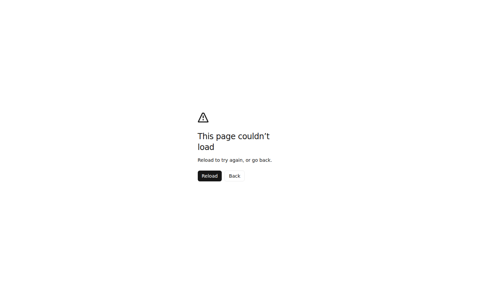
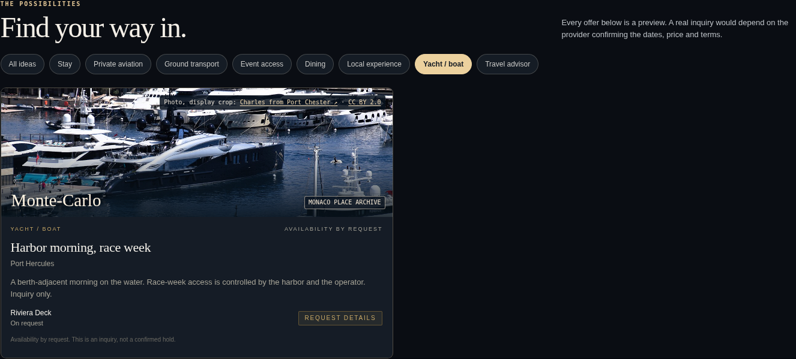
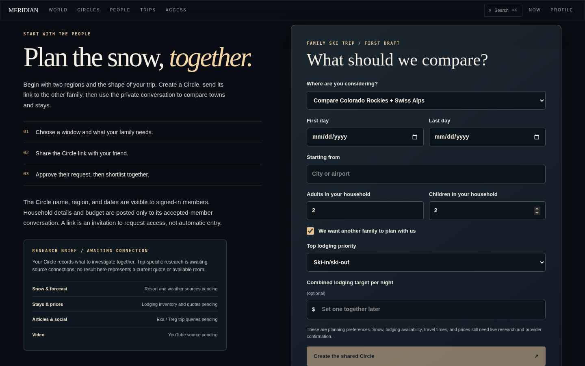
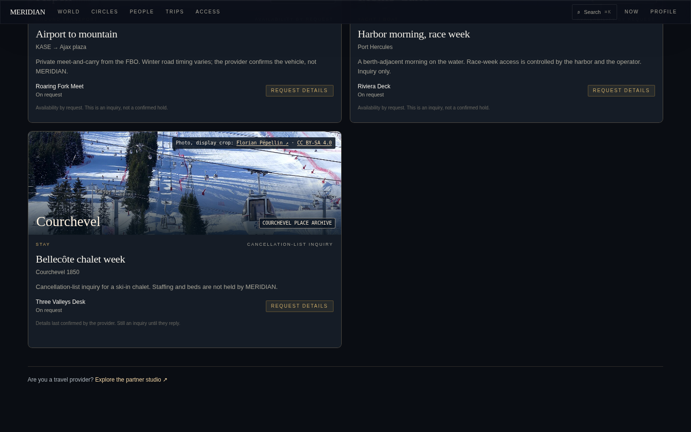

# UserFlow Red Team Report — MERIDIAN

Skill: `userflow-red-team` v1.1 · Discovery pass (no application code changed) · 2026-09-23

Per-persona detail, test tables and full evidence: [findings-A](findings-A.md) · [findings-B](findings-B.md) · [findings-C](findings-C.md) · [findings-D](findings-D.md) · [findings-E](findings-E.md) · tester brief: [BRIEF.md](BRIEF.md)

---

## 1. Executive Summary

### Product
MERIDIAN (`meridian` 0.1.0) · `main @ fb99093` (living-world merge #16 + cleanup #17) · environments:
- `http://localhost:3127` — production build (`next start`), **no providers configured** (Supabase, NOW venue provider, partners, research pipeline, X). This mirrors the documented Vercel preview state.
- `http://localhost:3128` — `next dev` with `NEXT_PUBLIC_MERIDIAN_DEMO=1` (simulated members), used only for member/social flows.

### Audit Scope
Five personas, each driven end-to-end in a real browser by a dedicated tester, then synthesised here:

| | Persona | Core job |
|---|---|---|
| A | First-time anonymous explorer | Find a place worth going to, know why and how far, keep it |
| B | Family winter ski planner | Pick a resort and week for two families, get it in front of the other family |
| C | On-the-ground phone traveler (Monaco) | Decide tonight (NOW); pursue an ACCESS offer |
| D | Group-trip host + invited guest | Onboard, set profile/privacy, start a circle, invite, see the guest respond |
| E | Travel provider + traveler counterpart | List an offer, have travelers find it, receive and answer the inquiry |

### Browser Environment
Playwright 1.56 Chromium (swiftshader WebGL), desktop 1440×900 (spot checks 1280×800, 1920×1080) and phone 390×844 (isMobile, hasTouch). Separate browser contexts per identity. Geolocation granted/denied via context permissions. Console, page errors and network failures captured. Tablet: UNTESTED.

Test-case totals across personas: 120 cases — PASS 36 · FAIL 61 · PARTIAL 18 · other 5 (edge/code-review/untested).

### Jev Status
**Connected.** `TYPESAFE_API_KEY` present; model `jev-1.13.0`; **47 calls, all HTTP 200** (1 connectivity check + 46 audit judgments). Every request/response is saved under [`artifacts/jev/`](artifacts/jev/). Testers passed Jev the persona, JTBD, workflow state and the text/controls actually visible (Jev does not see screenshots) and recorded where they disagreed with Jev.

### Treg External Validation Status
**Not connected** — no treg token or integration in this environment. All external checks: `EXTERNAL VALIDATION NOT EXECUTED`. (The app's own Treg research adapter is also unconfigured.)

### Overall Verification Coverage (major flows)
- EXECUTED - PASS: **4** (globe interaction; phone core discovery path; winter discovery + mountain lens; People privacy defaults)
- EXECUTED - FAIL: **13**
- EXECUTED - PARTIAL: **16**
- CODE-REVIEW ONLY: **4** (configured family-ski Circle; configured partner studio/inquiry — plus PGlite execution of migration 001; configured NOW provider; Supabase profile/Travel Modes)
- UNTESTED: **3** (tablet viewport; Travel Wire failure UI; partner forms in a browser — no environment renders them)

**73 findings** (A 16 · B 14 · C 14 · D 14 · E 15): BLOCKER 3 · DEAD END 6 · LOGIC FAILURE 8 · STATE FAILURE 9 · AMBIGUITY 17 · POOR FEEDBACK 5 · MISSING STEP 4 · RECOVERY FAILURE 2 · EDGE CASE 6 · UX FRICTION 7 · POLISH 6. About 10 are the same defect seen by more than one persona (see §13).

### Most Important Findings

1. **UFR-A01 — BLOCKER: the home-page search crashes the whole app.** Typing "Aspen", "ski" or any nonsense into "A place, a passion, a possibility…" throws `Cannot read properties of undefined (reading 'distanceKm')` and replaces MERIDIAN with "This page couldn't load". There is no `app/error.tsx`. *Orchestrator re-verified independently.* 
2. **UFR-E02 — BLOCKER: offers partners publish can never appear in ACCESS.** Nav ACCESS, the partner studio's "Traveler ACCESS" link and the event dossier all lead to `/access`, which renders only 5 hard-coded sample offers (`AccessFeed.tsx:68` → `listOpportunities()`). Real offers load only in `/community?tab=offers` and the globe panel. Jev: a traveler looks in ACCESS (p 0.97); handoff integrity 0.30/4. 
3. **UFR-D01 — BLOCKER: the invite handoff doesn't exist, even in demo.** The host has no invite control, and a guest following the app's own link format sees no invitation and joins the wrong cabin (Jev: guest knows they were invited 0.04). `CurrentMemberChip`, the only mount point for `SocialRoot`/`InviteDialog`/`MemberProfileSheet`, has not been rendered since `aac77e4` (Sep 17). PR #17 later deleted the orphaned `TopBar` that last referenced it.
4. **Honest but terminal "not configured" states — five dead ends of the same shape.** The family ski planner (B01: submit disabled from load, no copy/share fallback), NOW (C01: only exit loops back to NOW; Jev next-step usefulness 0.02), the partner studio (E01: Jev has_path_forward 0.08), real-mode Circles (D04) and invite links that say **"Sign in below" when nothing is below** (B10/D04/E14; Jev contradiction 0.89–0.96). 
5. **Provider-truth leaks in fixture and modeled data.** A sample offer from a fictional provider says "Details last confirmed by the provider" (B07/C05/E04; Jev "False claim" 0.15/3). Named sample providers read as real (Jev 0.84). "SKI SEASON 45" and "BOOKING PRESSURE 98 ↑" read as snow and scarcity facts (Jev 0.75). The palette shows a "SAVED" group of editorial fixtures to a user who saved nothing, and tags destinations "live" (A08/C12). Demo peer lift is unlabeled (D06, Jev 0.61). 
6. **Collected answers that nothing uses.** Onboarding asks for traveler kind, interests, home region and a Private/Discoverable choice, then nothing reads them. The selected option isn't visibly marked, and a refresh restarts the flow (A07, D03, D05; Jev completion 0.02 "Misleading", promise_kept 0.17).
7. **Two save systems contradict each other.** "Saved ✓" on the destination page, then "Event saving will be available when membership is connected" for the same event in the globe panel (A03; Jev contradiction 0.80).

What held up well (OBSERVED): route estimates are clearly labelled indicative. The snow outlook and mountain lens never invent conditions and use official Google Maps URLs. Research Pulse, Scene and X show honest "awaiting setup / no source check" states. ACCESS preview inquiries send nothing and say so. The People directory is private by default with labelled sample portraits. HTML in chat and cabin fields renders inert. Duplicate cabin creation is idempotent. There was no horizontal overflow at 390px, and no application page errors apart from A01.

---

## 2. Product Model

**Product Purpose.** A private travel-intelligence network organised around context rather than transactions: DISCOVER → CONNECT → PLAN → TRAVEL → NOW (`docs/PRODUCT.md`). Surfaces: PULSE (where the world gathers), CIRCLES (who to go with), ACCESS (how to make it happen), NOW (what to do right now).

**Primary Business Outcome.** Qualified trip intent — a traveler commits to an occasion, gathers their people, and hands an inquiry to a vetted provider — without MERIDIAN pretending to book, quote or hold inventory ("Partner offers create inquiries, not confirmed reservations or inventory locks").

**Major Inputs.** Curated event calendar; viewer origin (chosen city or rounded device location); season/interest/date choices; onboarding lens; saves/watches; circle and trip briefs; partner applications and offers; traveler inquiries; (unconfigured) provider feeds — NOW venues, research pipeline, social sources, Supabase membership.

**Major Outputs.** Ranked shortlists and globe journeys with indicative route estimates; destination pages; saved/watched lists; circles/trip rooms; partner offers; inquiries and replies; NOW picks.

**Key Workflow States.**
- Viewer origin: `none → chosen city | device (granted) → denied/unavailable`
- Discovery: `default → mode (season × interest) | plan (dates) → journey selected → destination`
- Intent: `unsaved → saved/watched (device-local)` vs `saved_events (membership)`
- Onboarding: `not started → step 1..5 → completed | skipped`
- Circle: `none → created (host) → invited → member joined`
- Provider org: `none → pending → approved`
- Offer: `draft → published → paused` (edit → draft)
- Inquiry: `new → replied → closed`
- Platform availability: `unconfigured | configured` — **the state that drives most failures in this audit**

---

## 3. Persona Inventory

| Persona | Context | Primary Job-to-Be-Done | Entry Point | Expected End State |
|---|---|---|---|---|
| A — First-time explorer | Anonymous, desktop then phone, no vocabulary | Find a place in my window, know why and how far, keep it | `/` | Shortlisted place with reasons + indicative distance, saved and findable later |
| B — Family ski planner | Parent, 2+2, Rockies vs Alps, second family | Pick resort/week and get a brief to the other family | `/` → Winter → Ski | Shortlist + week + a brief the other family can open (or an honest portable brief) |
| C — On-the-ground traveler | Phone, already in Monte-Carlo during the Yacht Show | Decide tonight; pursue an ACCESS offer | MORE → Now; ACCESS; dossier | Picks or an honest alternative; an inquiry sent, or a preview with a next step |
| D — Host + guest | Host organising Monaco GP group; guest receives a link | Onboard, set privacy, create circle, invite; guest joins | Lens banner; event panel; invite link | Circle exists; guest joined; host sees it |
| E — Provider + traveler | Yacht broker / chalet operator; traveler counterpart | List offer, get found, receive and answer inquiries | Footer "Partner with us" → `/partners` | Approved, published, discoverable offer; inquiry reaches provider; reply reaches traveler |

---

## 4. Flow Inventory

### Discovery → destination → save (A)
USER → `/` → choose city / device location → season × interest → shortlist card → globe journey + route estimate → **Open destination** → Save/Watch → Trips → reopen.
**Verification:** EXECUTED - PARTIAL (breaks: search crash A01; hidden CTA A09; save contradiction A03; Back/refresh lose state A06)

### Search (A)
USER → in-page search **or** ⌘K palette → result → destination.
**Verification:** EXECUTED - FAIL (in-page) / PASS (palette, with honesty issues A08)

### Winter discovery → mountain lens (B)
USER → Winter → Ski & snow → card → globe → mountain lens → official satellite/terrain links.
**Verification:** EXECUTED - PASS (with friction B11, B12)

### Family ski starter → shared Circle (B)
USER → "Start a family ski trip" → `/trips#family-ski` → brief → **Create the shared Circle** → share link → other family opens.
**Verification:** EXECUTED - FAIL (submit disabled from load; no portable brief; refresh wipes; no validation). Configured path: CODE-REVIEW ONLY.

### NOW (C)
USER → MORE → Now → where/intent/vibe/constraints → Find my next move → picks.
**Verification:** EXECUTED - FAIL (unconfigured: honest but circular dead end). Configured: CODE-REVIEW ONLY (`/api/now` 503 verified by curl).

### ACCESS offer → inquiry (C, E)
USER → ACCESS → filter → Request details → Preview inquiry → next step.
**Verification:** EXECUTED - FAIL (honest preview, no outcome; offer out of view; fixtures only)

### Onboarding / traveler lens (A, D)
USER → banner Begin → `/welcome` 1..5 → Enter World.
**Verification:** EXECUTED - FAIL (answers unused; no selected state; refresh restarts; Back exits)

### Circle create → invite → guest joins (D)
HOST → event panel → start cabin/Circle → post → invite → GUEST opens link → joins → HOST sees 2/8.
**Verification:** EXECUTED - FAIL in both modes (real: circular dead end; demo: no invite control, invitation never shown)

### Partner apply → publish → traveler inquiry → reply (E)
PROVIDER → `/partners` → apply → (approval) → publish → TRAVELER finds offer → inquiry → PROVIDER replies → TRAVELER reads.
**Verification:** EXECUTED - FAIL (browser, disconnected dead end + discovery break) · CODE-REVIEW ONLY + PGlite (configured lifecycle: one-shot, anonymous, unguarded transitions)

---

## 5. Persona Test Reports (summary — full tables in findings-*.md)

| Persona | Flows | Test cases: PASS / FAIL / PARTIAL / other | Jev calls | Key failures |
|---|---|---|---|---|
| A | 9 | 15 / 12 / 4 / 0 (31) | 11 | A01 crash, A03 save contradiction, A04/A05 location, A06 state loss, A07 lens unused |
| B | 5 | 7 / 8 / 5 / 0 (20) | 9 | B01 dead end, B02 validation, B03 refresh, B04 resort dropped, B06/B07 honesty |
| C | 6 | 6 / 13 / 3 / 1 edge (23) | 9 | C01 NOW loop, C03 offer out of view, C04 preview no outcome, C05 false provider claim |
| D | 7 | 4 / 15 / 4 / 0 (23) | 9 | D01 invite, D02 inert profile, D03 onboarding unused, D04 loop, D05 no selected state |
| E | 5 | 4 / 13 / 2 / 4 (code-pass 1, untested 1, edge 2) (23) | 8 | E01 dead end, E02 offers never in ACCESS, E03 false empty, E05 one-shot inquiry, E08 silent unpublish |

**Representative Jev findings** (question → result → interpretation):

| Finding | Question | Jev result | Tester interpretation |
|---|---|---|---|
| C01 | How useful is the next step offered on unconfigured NOW? | 0.02 "Useless or circular" (p 0.99, conf 0.98) | Agree |
| E02 | Where would a traveler look for real partner offers? | `access` p 0.97; handoff integrity 0.30/4 | Agree |
| D01 | Can the guest tell they were invited? | 0.04; next action `join_wrong_cabin` 0.9 | Agree |
| C05 | Is "Details last confirmed by the provider" honest on this sample? | 0.15/3 "False claim" (p 0.87) | Agree |
| B07 | Does the parent believe the named provider is real? | 0.84 | Agree |
| D03 | Did onboarding complete in a way the user understands? | 0.02 "Misleading" (p 0.98) | Agree |
| A03 | Does the user perceive a contradiction in saved state? | 0.80 | Agree |
| A05 | Is a location prompt on first paint appropriate? | 0.2/3 (p0 "clearly inappropriate" 0.83) | Agree |
| B01 | Can the parent get the brief to the other family? | 0.20; next action `look_for_sign_in` 0.88 | Partly disagree — Jev over-credits visibility of the disabled state |
| A09 | Will the user find "Open Aspen"? | 0.34; likely `scroll_panel` 0.97 | Disagree on likely action — Jev was told the CTA exists |

Methodological note: Jev judged tester-composed text descriptions of visible state. Where testers disagreed, the finding records both. Numbers are quoted verbatim from `artifacts/jev/*.json`.

---

## 6. Cross-User Handoffs

| Origin Persona | Receiving Persona | Handoff | Result | Problem |
|---|---|---|---|---|
| B parent | Other family | Shared Circle link from the ski brief | FAIL | No link can be generated; no portable brief (B01) |
| D host (real) | D guest | `/community?circle=<uuid>` | FAIL | Guest told "Sign in below", nothing below (D04/B10/E14) |
| D host (demo) | D guest (demo) | `/?event=…&group=…` | FAIL | No invite control; invitation strip never mounted; cabins device-local; host still 1/8 (D01, D09) |
| E provider | Traveler | Published offer → ACCESS | FAIL | ACCESS never shows real offers (E02); offers tab asserts "none yet" while unqueried (E03) |
| Traveler | E provider | Inquiry → studio | CODE-REVIEW + PG | Provider sees message only, no identity/contact; no notification (E05) |
| E provider | Traveler | Reply → requests | CODE-REVIEW + PG | One-shot; traveler can't follow up/withdraw; closed→new allowed, reply overwritten (E05, E12) |

## 6A. External Reality Validation

| Related Test | Application Claim | External System / Source | Treg Capability / Provider | Result | Evidence |
|---|---|---|---|---|---|
| B-T08 / B07 | Sample provider names ("High Country Houses", "Three Valleys Desk"…) are illustrative | Public business registries/web | — | NOT VERIFIED | EXTERNAL VALIDATION NOT EXECUTED |
| B-T02 | Mountain lens opens an approximate area | Google Maps URLs API | — (URL format checked in browser only) | NOT VERIFIED | href format matches official `map_action=map` form |
| A/B galleries | Photos are attributed Wikimedia Commons archive images | Wikimedia Commons | — | NOT VERIFIED | Wikimedia thumbs blocked by sandbox proxy cert (`ERR_CERT_AUTHORITY_INVALID`) |
| E-T09 / C-T07 | Preview inquiry sends nothing | Network | Browser network log (not treg) | MATCH | 0 non-GET requests |

---

## 7. Finding Register

The register below lists the consolidated material findings. Every per-persona finding (73) with full Problem / Impact / Expected / Actual / Jev / Root cause / Fix / Acceptance fields is in the findings-*.md files.

| ID | Severity | Evidence | Persona(s) | Location | Problem | Root cause | Acceptance test |
|---|---|---|---|---|---|---|---|
| **UFR-A01** | BLOCKER | OBSERVED ×2 | A | `/` in-page search | Any query without a same-day match crashes the app | `DiscoveryExperience.tsx:155-158` `undefined===undefined` → `nearbyScenes[0].distanceKm`; no `app/error.tsx` | "Aspen"/"ski"/"qwzxv" → no page error, shell intact |
| **UFR-E02** | BLOCKER | OBSERVED | E, C | `/access` | Published offers never shown where every link sends travelers | `AccessFeed.tsx:68` fixtures only; real offers only in `Community.tsx:147-154`, `LivePulse.tsx:27-34` | Published offer visible on `/access` to an anonymous context |
| **UFR-D01** | BLOCKER | OBSERVED | D | demo event panel / invite link | No invite control; invitation never shown; host never sees guest | `CurrentMemberChip` (sole `SocialRoot` mount) unrendered since `aac77e4`; cabins device-local | Seeded group link shows "You were sent this" + "Take a seat" |
| UFR-B01 | DEAD END | OBSERVED | B | `/trips#family-ski` | Submit disabled from load; no portable brief; not told nothing saved | `TripsPage.tsx:220-230` | Banner in first viewport; "Copy our trip brief" works unconfigured |
| UFR-C01 | DEAD END | OBSERVED | C | `/now` | Only exit loops `/` → "Already there?" → `/now` | `NowExperience.tsx:178-183,261-262`; `LivingDashboard.tsx:55` | Destination link in first 844px; no exit returns to `/now` |
| UFR-C04 | DEAD END | OBSERVED | C, E | `/access` preview inquiry | Preview shows no draft, persists nothing, no next step | `AccessFeed.tsx:148-158` | Draft + "nothing sent" + concrete next step |
| UFR-D04 | DEAD END | OBSERVED | D, B, E | Circles/Community real mode | Circular links; "Sign in below" with nothing below | `Community.tsx:359` no `client` guard; CTAs not gated | No "Sign in below" without a client; no create link to a page without a form |
| UFR-E01 | DEAD END | OBSERVED | E | `/partners` | Honest but no path forward for providers | `partners/page.tsx:232-240` | Shows partner model + honest contact/not-open state |
| UFR-C05 (=B07, E04) | LOGIC FAILURE | OBSERVED | B, C, E | ACCESS/destination sample cards | Fixture claims "Details last confirmed by the provider"; named providers read as real | `fixtures.ts:77` `provider_updated`; `types.ts:47` | No fixture renders provider-confirmation copy (unit test) |
| UFR-D03 (=A07) | LOGIC FAILURE | OBSERVED | A, D | `/welcome` | Answers and "Discoverable" never used; "For you" not personal | onboarding store read only for `completed` | Either lens applied, or no personalization claim; local-only disclosure |
| UFR-B04 | LOGIC FAILURE | OBSERVED | B | shortlist → starter | Starter can't express shortlisted resorts; resort/week dropped | `familySki.ts:1,16-20`; link passes only season/interest | Jackson Hole card → form prefilled with resort and dates |
| UFR-B02 | LOGIC FAILURE | OBSERVED | B | family ski form | Past dates, end<start, 0 adults accepted silently | `familySki.ts:62-70`; submit-only validation | Vitest rejects 2019 start; inline errors |
| UFR-A11 | LOGIC FAILURE | OBSERVED | A | `/` dates mode | Dates silently drop season/interest; legend still "WINTER ATLAS" | `DiscoveryExperience.tsx:94-95,347,370` | Filters combine or chip explains |
| UFR-E06 | LOGIC FAILURE | OBSERVED (code+PG) | E | live offer card | Provider name hidden; free-text price unqualified | `Community.tsx:47-58,581-605`; `platform/types.ts:37` | Name rendered; "Confirmed … book now" rejected |
| UFR-B09 | LOGIC FAILURE | OBSERVED | B | `/destinations/st-moritz` | Card for New Year Week opens a Cresta Run page | `DestinationPage.tsx:169-171` earliest event | `?event=` preferred; hero shows chosen occasion |
| UFR-A03 | STATE FAILURE | OBSERVED | A | destination vs globe panel | "Saved ✓" then "saving will be available…" | Two stores: `useIntentStore` vs `EventSaveButton` (Supabase) | Saved shows consistently across surfaces |
| UFR-A04 | STATE FAILURE | OBSERVED | A | origin | City → device → deny: contradictory; city lost | `useViewerLocation.ts:69,87-92` | Deny keeps Atlanta estimate + notice; reload keeps it |
| UFR-A06 (=B05) | STATE FAILURE | OBSERVED | A, B | `/` | Back leaves app; refresh resets; not shareable | `DiscoveryExperience.tsx:75-76` state not in URL | Reload/Back restore Winter + selection |
| UFR-B03 | STATE FAILURE | OBSERVED | B | family ski form | Refresh wipes the brief | uncontrolled inputs, no draft | Reload restores draft; sign-out clears |
| UFR-D05 | STATE FAILURE | OBSERVED | D, A | `/welcome` | No visible selected state (incl. privacy); refresh → step 1; Back exits | `.glass` border overrides `border-brass`; step in `useState` | `aria-pressed` + visible ring; `?step=` |
| UFR-E08 | STATE FAILURE | OBSERVED (PG) | E | partner studio | Editing a published offer silently unpublishes; delete → raw FK error | `partners/page.tsx:162-171,548-563`; `001_platform.sql:53` | Hidden notice; no Delete when inquiries exist |
| UFR-B06 | AMBIGUITY (honesty) | OBSERVED | B | destination Pulse signals | "SKI SEASON 45", "BOOKING PRESSURE 98 ↑" read as facts | `pulse/fromEvents.ts:300-313` | No number beside "Ski season"; MODELED chips |
| UFR-A08 (=C12) | AMBIGUITY (honesty) | OBSERVED | A, C | ⌘K palette | "SAVED" fixtures for users who saved nothing; "live" status | `search/catalog.ts:36,78,132-141` | No "Saved" until user saves; no bare "live" |
| UFR-D06 | AMBIGUITY (honesty) | OBSERVED | D | demo event panel | Simulated peer lift unlabeled; `DEMO_LABEL` unused | `EventDossier.tsx:336-360`; `flags.ts:5` | Demo label above fold on every screen |
| UFR-E03 | POOR FEEDBACK (honesty) | OBSERVED | E | `/community?tab=offers` | "No published offers… yet" while never queried | `Community.tsx:571-579` ignores `client` | No zero-offers claim without a client |
| UFR-A05 | POOR FEEDBACK | OBSERVED | A | `/` | Location prompt at ~800 ms without gesture; denied click silent | `useViewerLocation.ts:123` | 0 geolocation calls before a click |
| UFR-E05 | MISSING STEP | OBSERVED (PG) | E | inquiry lifecycle | One-shot, anonymous to provider, no notifications, wrong "in their account" copy | `001_platform.sql:138-140`; `partners/page.tsx:621-623` | Chosen follow-up behaviour covered by PGlite test |
| UFR-A10 | MISSING STEP | OBSERVED | A | destination page | "How far from me" absent | `DestinationPage.tsx:219-224` | Indicative distance from chosen city |

(Remaining AMBIGUITY, EDGE CASE, UX FRICTION and POLISH items: A02, A09, A12–A16, B08, B10–B14, C02, C03, C06–C11, C13, C14, D02, D07–D14, E07, E09–E15 — see persona files.)

---

## 8. Dead-End Inventory

| ID | Persona | Location | Entry Path | Recovery Available? |
|---|---|---|---|---|
| A01 | A | `/` | type in page search | Reload only; same query re-crashes |
| A06 | A | `/` | card → browser Back | No — leaves to `about:blank` |
| B01 | B | `/trips#family-ski` | Winter → Ski → Start a family ski trip | No — nothing to save, copy or share |
| B08/D04 | B, D | `/circles` → `/community` | "Start a trip" / "Start a Circle here" | No — loops to "Membership is not connected yet" |
| B10/D04/E14 | B, D, E | `/community?circle=<uuid>` | invite link | No — "Sign in below", nothing below |
| C01 | C | `/now` | MORE → Now / "Already there?" | Loop back to `/now` |
| C04 | C, E | `/access` | Request details → Preview inquiry | "See all" only |
| D01 | D | demo invite link | host link → guest | Guest joins wrong cabin |
| D02 | D | demo avatars, `/account` | click face / Profile | No |
| E01 | E | `/partners` | footer "Partner with us" | "Explore the world" only |
| E05 | E | traveler after reply | Community → Your requests | Cannot respond |

## 9. Ambiguity Inventory

| ID | Persona | Location | Ambiguity | Risk |
|---|---|---|---|---|
| C05/B07/E04 | B, C, E | sample offers | fixture claims provider confirmation; named providers | High (provider truth) |
| B06 | B | destination signals | modeled numbers read as snow/scarcity | High (provider truth) |
| A08/C12 | A, C | palette | "SAVED" fixtures; "live" | High (fake/live confusion) |
| D06 | D | demo panel | simulated peers unlabeled | Medium (stakeholder demos) |
| A02 | A | two search boxes | different scopes | Medium |
| B08 | B | five "start" CTAs | three destinations, none completes | High |
| D10/E10 | D, E | cabin vs Circle vs Trip room vs partner offers | concept collision | Medium |
| A12 | A | dossier | "LEAD TIME Today" for December event | Medium |
| A13/D07 | A, D | panel, Wire, People | internal jargon, vendor names, "PR #8" | Medium (trust) |
| C08 | C | Monaco offer | undated "race week" read as this week | Medium |
| E07 | E | partner taxonomy | yacht broker has no category | Medium |
| C02 | C | `/now` mobile | notice below fold; inert form looks live | Medium |

## 10. State-Machine Problems

| ID | Current State | Action | Expected Next State | Observed Next State |
|---|---|---|---|---|
| A01 | today mode, query with no match | type | empty state | app crash |
| A03 | saved (device) | open same event panel | saved | "saving will be available…" |
| A04 | origin = chosen city | Use device location → deny | chosen city retained | "Viewing Atlanta" + "Choose your city"; storage wiped |
| A06/B05 | journey selected / Winter mode | Back / reload | restored | leave app / reset |
| A11 | Winter · Ski | choose dates | combined filter | mode dropped; legend stale |
| B03 | brief half-filled | reload | draft restored | all reset |
| B09 | "St. Moritz New Year Week" card | open destination | that occasion | earliest event (Cresta Run) |
| D05 | onboarding step 3 | reload / Back | step 3 / step 2 | step 1 / exit |
| D08 | host of cabin | Leave | confirm/undo | cabin deleted, messages orphaned, interest still committed |
| E08 | offer published | edit + save | still live or clearly hidden | silently draft; inquiry loses title |
| E12 | inquiry closed | provider replies again | guarded | closed → new, reply overwritten |
| E13 | provider pending | admin approves | provider notified | no signal; manual refresh |

## 11. Permission Problems

| ID | Persona | Object / Action | Expected Permission | Observed Permission |
|---|---|---|---|---|
| A05 | Visitor | geolocation | requested on user gesture | requested on page load |
| B01/D04 | Visitor | create circle / sign in | clear "unavailable" with alternative | disabled/circular; "Sign in below" |
| E05 | Provider | read inquirer contact | consented contact channel | denied (privacy-correct) with no alternative |
| E05 | Traveler | update/withdraw own inquiry | allowed | denied (no policy) |
| E12 | Provider | reopen closed inquiry, overwrite reply | constrained | allowed |
| — | Provider | self-approve | denied | denied ✔ (project RLS test) |
| — | Third user | read others' inquiries | denied | denied ✔ (project RLS test) |
| — | Visitor | see private profiles | denied | denied ✔ (private by default, labelled samples) |

## 12. Automation Opportunities

| Current Manual Step | Why It Exists | Could Be Automated? | Recommendation |
|---|---|---|---|
| Re-enter resort and dates in the family ski form | Card → form passes only season/interest | Yes | Pass `event=<id>` and prefill (B04) |
| Pick a city on NOW when unconfigured | Location step removed | Yes | Map rounded device location / chosen city to nearest curated destination (C01) |
| Provider presses Refresh to see approval / inquiries | No notifications | Yes | Realtime subscription or email on status change (E05, E13) |
| Parent composes a message to the other family | No share when unconfigured | Yes | Generate and copy the private brief (B01) |
| Traveler re-types origin on destination pages | Origin lives only in discovery | Yes | Read stored chosen city (A10) |

---

## 13. Highest-Leverage Fixes (grouped by root cause)

### Root Cause 1 — "Unconfigured" is treated as a terminal state
Affected: B01, B08, B10, C01, C02, C04, D02, D04, E01, E03, E14 (11 findings, 5 dead ends).
Every provider-backed surface correctly admits it's disconnected, then offers no useful action, loops, or asserts a false empty state. **Systemic fix:** one `platformAvailable()` / per-provider availability check, used by *every* CTA that leads into a provider-backed flow (de-link or relabel circular CTAs), plus a shared unavailable-state component with three required parts: what isn't available, what was/wasn't saved, and one useful next action that works without the provider (copy brief, choose city → destination edit, contact partners). REVIEW_REQUIRED (user-flow change).

### Root Cause 2 — Parallel sources of truth for the same concept
Affected: E02, C04, E06, E07 (offers: fixtures vs Supabase); A03 (saves: intent store vs `saved_events`); D10, B08 (circle vs cabin vs trip room); A07, D03, D09 (onboarding draft vs profile vs demo identity).
**Systemic fix:** decide the canonical model for offers, saves, circles and member identity, then have every surface read it. ACCESS should render real offers when configured and samples (clearly labelled) only when not. The device-local save should be shown everywhere until membership sync exists. HIGH_CAPABILITY_ONLY (source-of-truth / architecture).

### Root Cause 3 — Provenance is implicit, so fixtures and models speak like live data
Affected: B06, B07/C05/E04, A08/C12, A13, C08, D06, D07, E03.
**Systemic fix:** a typed provenance field on every displayed datum (`sample | editorial | modeled | provider | live`) rendered through one label component; fixtures may not use `provider_updated`; "live" pulse status maps to "on now"; the demo label is always visible; vendor names and internal references stay out of UI copy. Add unit tests that fixtures never render provider-confirmation or "live" copy. CHEAP_OK for copy, REVIEW_REQUIRED for the model.

### Root Cause 4 — Journey context lives in component state and is dropped at every handoff
Affected: A06, B05, B03, B04, B09, A11, A12, A14, A15, C06, C09, D05, E11.
**Systemic fix:** URL as state for discovery (`season`, `interest`, `event`, `step`), thread `event`/`destination` through every handoff link (dossier → ACCESS/circles, card → destination → trips), not-found notices for unknown ids, and session drafts for forms. REVIEW_REQUIRED.

### Root Cause 5 — No resilience layer
Affected: A01 (and any future render error). **Fix:** the one-line guard plus `src/app/error.tsx` that keeps the shell. CHEAP_OK; should ship first.

### Root Cause 6 — Location handling
Affected: A04, A05, A10, C01, C03-T03. **Fix:** request only on gesture; keep the chosen city until a device fix succeeds; distinguish denied vs unavailable; reuse the chosen city (never device coordinates) on destination pages. HIGH_CAPABILITY_ONLY (precise-location handling).

### Root Cause 7 — Orphaned social layer
Affected: D01, D02, D09, D11. `SocialRoot` lost its only mount when the shell was unified (`aac77e4`). **Fix:** mount `SocialRoot` in `AppShell` under `isDemoMode()` and show honest device-local messaging. REVIEW_REQUIRED.

### Root Cause 8 — Partner inquiry lifecycle is incomplete in the data model
Affected: E05, E08, E09, E12, E13, E07. **Fix:** inquiry state machine (`new→replied→closed`) with history, consented contact or thread table, notifications, FK-safe delete/pause, error-code mapping, taxonomy incl. yacht. HIGH_CAPABILITY_ONLY (migrations + RLS, PGlite tests).

---

## 14. Retest Plan

| Priority | Flow | Persona | Starting State | Acceptance Criteria |
|---|---|---|---|---|
| P0 | In-page search | A | `/`, fresh context, location granted and denied | "Aspen", "ski", "qwzxv" → no page error; results or "No scenes in this view" + Clear; shell intact on any thrown error |
| P0 | Sample offer honesty | B, C, E | `/access`, `/destinations/courchevel` | No fixture renders "confirmed by the provider"; every sample card has a Sample chip; unit test enforces it |
| P0 | Partner → traveler discovery | E | Configured Supabase, approved provider publishes | Anonymous `/access` lists the offer with provider name; studio link lands on it |
| P0 | Demo invite handoff | D | `:3128`, two contexts, seeded group link | Guest sees "You were sent this" + "Take a seat"; unknown cabin → honest device-local message |
| P1 | Family ski unconfigured | B | `/trips?season=winter&interest=ski`, no Supabase | Banner in first viewport; valid input → brief copied; invalid → inline errors; reload restores draft |
| P1 | NOW unconfigured | C | `/now`, 390×844, Monaco location | Notice above fold; destination link visible; no exit loops to `/now` |
| P1 | Invite link unconfigured | B, D, E | `/community?circle=<uuid>`, no Supabase | No "Sign in below"; honest alternative copy |
| P1 | Save consistency | A | Save on `/destinations/aspen` | Globe panel and Trips show "Saved (this device)"; no "will be available" beside a saved item |
| P1 | Onboarding | A, D | `/welcome` | Selected option visibly marked + `aria-pressed`; refresh keeps step; completion states local-only or applies lens |
| P1 | Discovery state | A, B | Winter → Aspen selected | Reload and Back restore mode + selection; dates combine with mode |
| P2 | Location | A | city chosen → device denied | Chosen city retained with notice; 0 geolocation calls before a click |
| P2 | Modeled signals | B | `/destinations/aspen` | No number beside "Ski season"; modeled values carry MODELED chips; no arrows |
| P2 | Offer view | C | `/access` → Request details; cold deep link | Selected offer in viewport and focused; bogus id → notice |
| P2 | Inquiry lifecycle | E | PGlite with migrations | closed→new rejected; history kept; edit shows hidden notice; delete with inquiries blocked |
| P3 | Polish | A, B, C, D | 390×844 | "Aspen is calling."; no `a button`; cabin titles ≥120px; long tokens wrap |

---

## 15. Evidence Appendix

- **Screenshots:** [`artifacts/`](artifacts/) — 88 PNGs: 85 persona screenshots named `<PERSONA>-<NN>-<slug>.png`, 2 recon (`recon-home-*.png`) and the orchestrator's re-verification `VERIFY-UFR-A01-orchestrator.png`.
- **Jev:** [`artifacts/jev/`](artifacts/jev/) — 47 JSON files (request + response + HTTP status + timestamp), all HTTP 200, `jev-1.13.0`.
- **PostgreSQL (PGlite):** persona E ran `supabase/migrations/001_platform.sql` with the project's platform tests (3 files, 21 tests passed) and a read-only probe (session scratchpad `rt-E/pglite-probe.mjs`).
- **Source references:** `file:line` cited in every finding. Key: `DiscoveryExperience.tsx:155-158` (A01), `AccessFeed.tsx:68` (E02), `social/CurrentMemberChip.tsx` never rendered — `git log -S "<TopBar"` → `aac77e4` removed the last mount (D01), `lib/access/fixtures.ts:77` + `types.ts:47` (C05), `Community.tsx:359` (D04), `TripsPage.tsx:220` (B01), `NowExperience.tsx:178-183` (C01).
- **Console:** no application page errors except A01. Noise only: aborted `_rsc` prefetches, WebGL/THREE warnings, Wikimedia thumbnails blocked by the sandbox proxy certificate (environmental, not an app defect).
- **Test scripts:** session scratchpad `rt-A` … `rt-E` (not committed; ephemeral).
- **Limits:** No configured Supabase/NOW/partner environment was available, so configured flows are CODE-REVIEW ONLY (plus PGlite for partner data rules). Treg external validation not executed. Tablet untested. Jev judged text descriptions, not images.

---

## Proposed fix plan (ordered by dependency, not cosmetic severity)

1. **Resilience (no dependencies, ship first)** — A01 guard + `app/error.tsx`. *CHEAP_OK.*
2. **Provenance labels and honesty copy** — fixture `sample` state, remove `provider_updated` from fixtures, Sample chips, "live" → "on now", palette "Editorial ideas", MODELED chips, demo label, remove vendor names / "PR #8". Unblocks trustworthy retesting of everything else. *CHEAP_OK copy + REVIEW_REQUIRED model.*
3. **Availability gate + unavailable-state pattern** — `platformAvailable()` used by all provider-backed CTAs; fix B01 (copy brief), C01 (destination alternative), C04, D04/B10/E14 ("Sign in below"), E01, E03. Depends on 2 for copy conventions. *REVIEW_REQUIRED.*
4. **Source-of-truth decisions** — offers (ACCESS reads real offers; samples only when unconfigured), saves (one model, device-local shown everywhere), circle concept (one name; list device cabins), onboarding → profile (local-only disclosure, prefill after sign-in). Must precede 5–7. *HIGH_CAPABILITY_ONLY.*
5. **Journey context in URL + handoff threading** — discovery params, `event`/`destination` through dossier → ACCESS/circles/trips/destination, form drafts, onboarding `?step=`, not-found notices. Depends on 4 for target surfaces. *REVIEW_REQUIRED.*
6. **Location** — gesture-only request, keep chosen city on denial, denied vs unavailable copy, destination-page distance from chosen city. Depends on 5 (origin in URL/session). *HIGH_CAPABILITY_ONLY.*
7. **Social layer in demo** — mount `SocialRoot` in `AppShell` under `isDemoMode()`, host Invite control, honest device-local messaging, identity from onboarding. Depends on 4 (circle concept). *REVIEW_REQUIRED.*
8. **Partner inquiry lifecycle** — migrations for inquiry state machine/history, consented contact or thread, taxonomy (yacht), FK-safe delete/pause, error mapping, notifications; PGlite RLS tests. Depends on 4. *HIGH_CAPABILITY_ONLY.*
9. **Validation and polish** — B02 date/party validation, D12 wrapping/caps, C13 nested button, A16/B14 spacing, D11 mobile titles, A09/B11 panel CTA placement.

No fixes were made in this pass. Per the skill, implementation should follow owner approval, then rerun the §14 retest plan with before/after screenshots.
